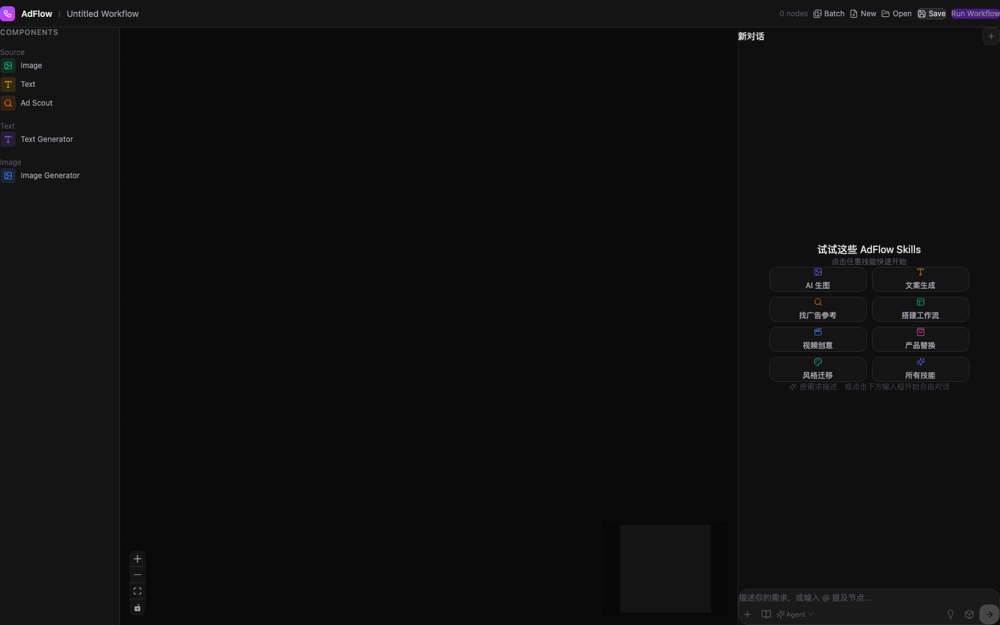
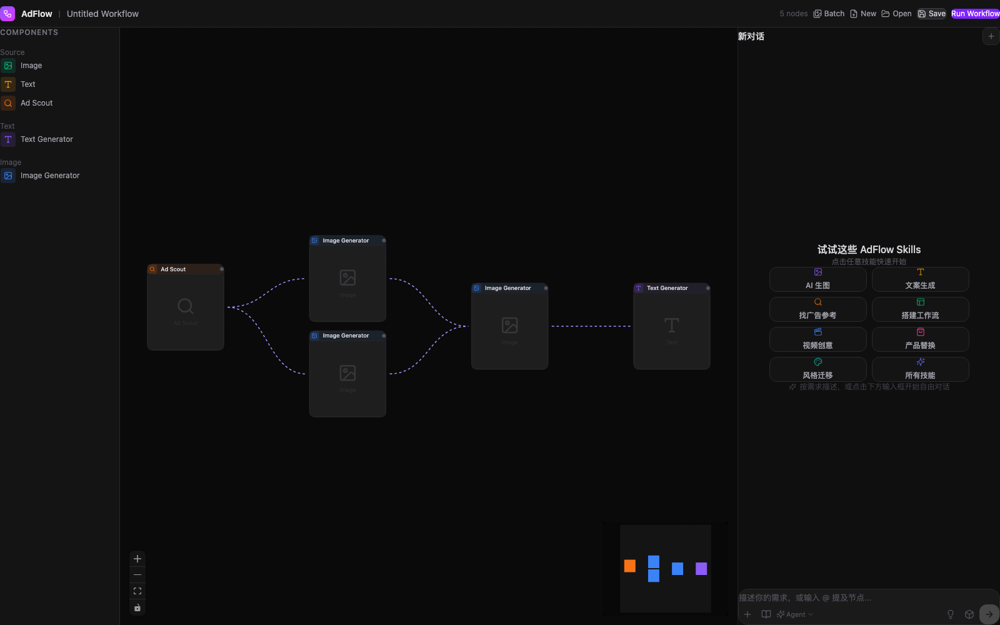
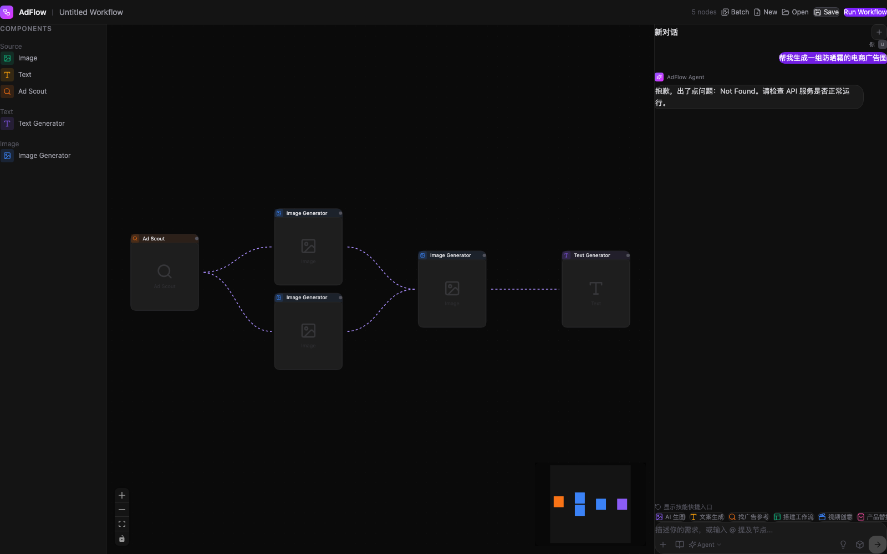
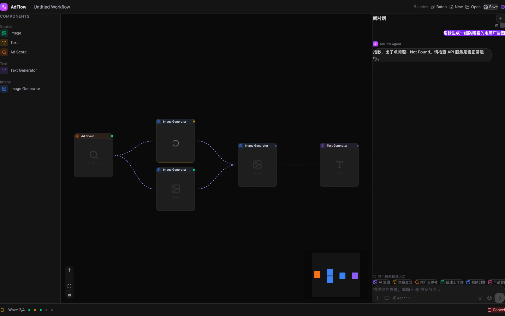
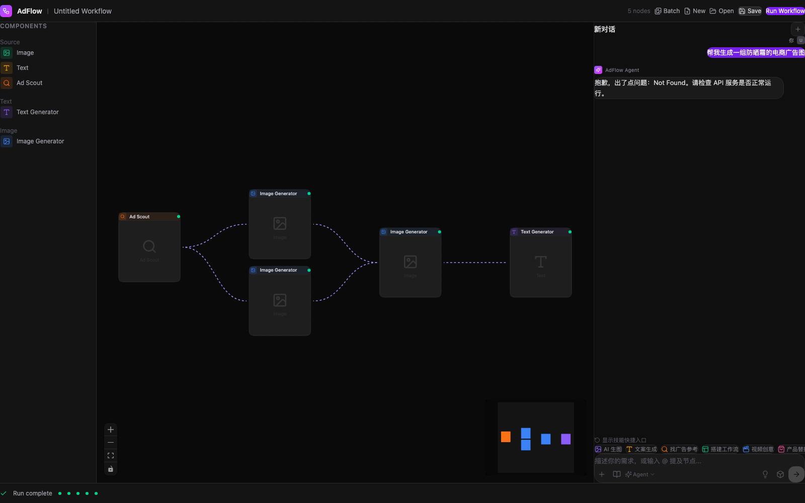
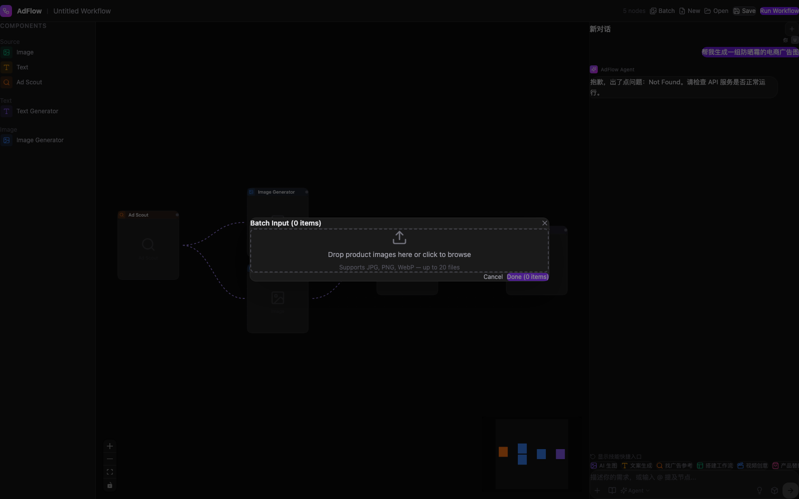

# AdFlow 界面截图归档

> 自动生成于 2026-05-21

---

## 01. 首页 — 空画布



- 左侧 COMPONENTS 节点库（Image / Text / Ad Scout / Text Generator / Image Generator）
- 中间 React Flow 画布（空）
- 右侧 Agent 面板 — Skills 快捷入口（AI 生图 / 文案生成 / 找广告参考 / 搭建工作流 / 视频创意 / 产品替换 / 风格迁移 / 所有技能）
- 底部输入栏（Plus / BookOpen / Agent / Lightbulb / Box / 发送按钮）

---

## 02. 工作流画布 — 完整节点连线



- 5 个节点串联成完整广告工作流：
  - **Ad Scout** → 找参考
  - **Image Generator** ×2 → 风格迁移 + 换脸（并行）
  - **Image Generator** → 产品替换
  - **Text Generator** → 排版导出
- 紫色虚线连线，带动画效果
- 左下角 Controls + MiniMap

---

## 03. 节点选中状态


- product-1 节点被选中（React Flow 高亮边框）

---

## 04. Agent AI 助手对话



- 用户消息气泡（紫色，圆角 iMessage 风格）
- Agent 回复气泡（深色，圆角）
- 技能快捷 pills 行（AI 生图 / 文案生成 / 找广告参考 / 搭建工作流 / 视频创意 / 产品替换）
- 底部工具栏（Plus / BookOpen / Agent 下拉 / Lightbulb / Box / 白色发送按钮）

---

## 05. 执行中 — Wave 进度



- 底部 ExecutionMonitor 显示 Wave 2/4
- 节点状态指示灯：
  - 绿色 = completed
  - 黄色旋转 = running
  - 灰色 = idle
- Cancel 按钮

---

## 06. 执行完成



- 所有节点绿色完成
- 底部显示 "Run complete"

---

## 07. 批量上传对话框



- 模态框：Batch Input (0 items)
- 拖拽区域：Drop product images here or click to browse
- 支持 JPG, PNG, WebP — up to 20 files
- Cancel / Done 按钮

---

## 截图脚本

```bash
cd /Users/edy/ad-flow
node scripts/screenshot.js
```

输出目录：`docs/screenshots/`
